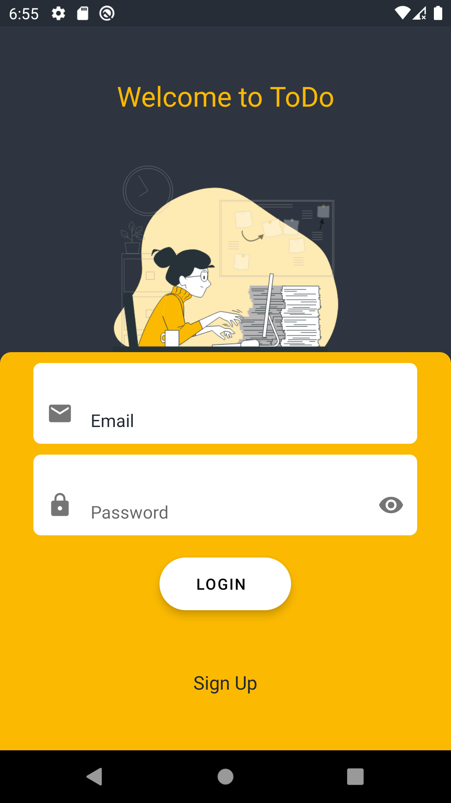
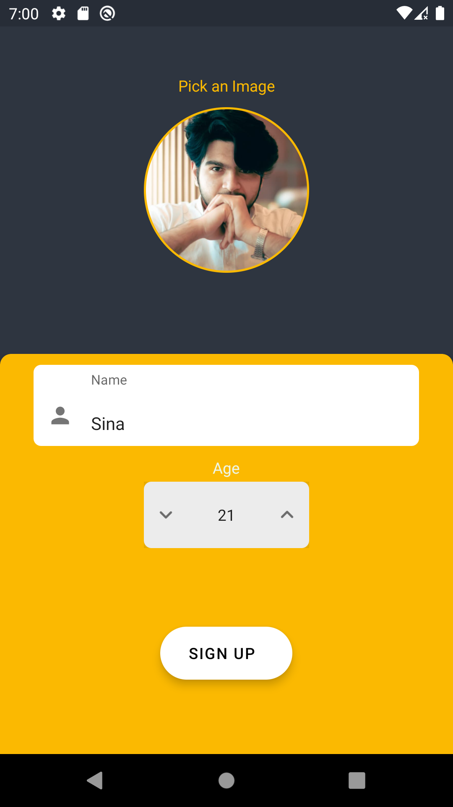
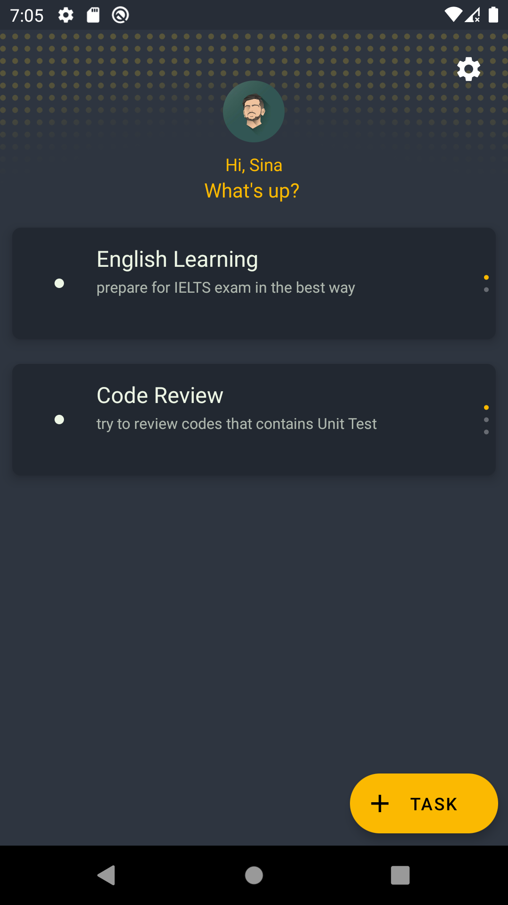
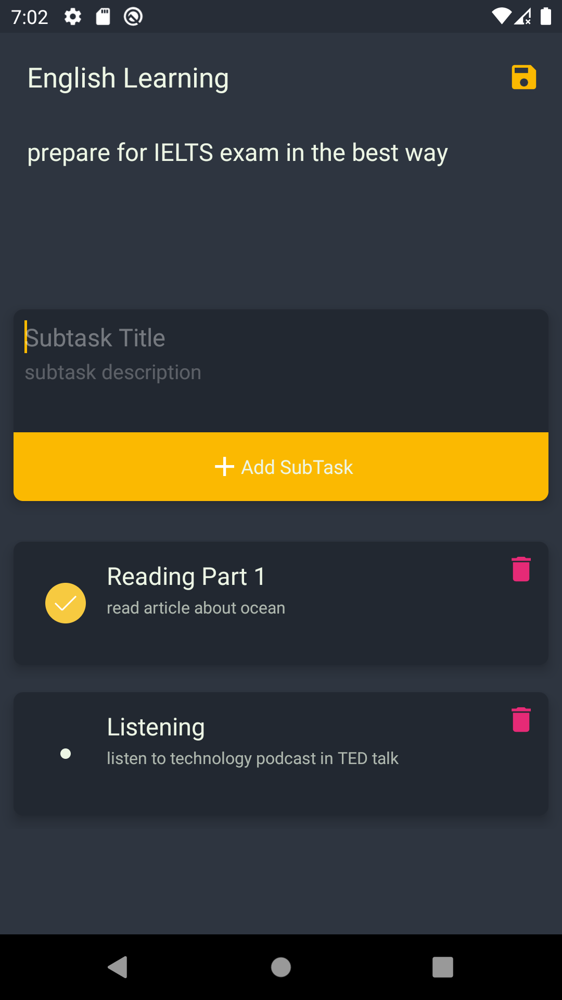

# ✔ Todo

Simple Todo List application that using Hilt for DI [Hilt](https://github.com/google/dagger).

## 📱 Screenshots

| Login Screen 🌕 | SignUp Screen 🌕 | Main Screen 🌕 | Task Screen 🌕 |
| ---- | ---- | ---- | ---- |
|  |  |  |  |

## ✨ Details

if you choose to cloud-sync On , then all your data will save into [TODO LIST API](https://api-nodejs-todolist.herokuapp.com)
for reading about API documentation refer to [TODO LIST API Documents](https://documenter.getpostman.com/view/8858534/SW7dX7JG)

## 📄 Licence
```
Copyright (c) 2021 Sina Dalvand

Licensed under the Apache License, Version 2.0 (the "License");
you may not use this file except in compliance with the License.
You may obtain a copy of the License at

http://www.apache.org/licenses/LICENSE-2.0

Unless required by applicable law or agreed to in writing, software
distributed under the License is distributed on an "AS IS" BASIS,
WITHOUT WARRANTIES OR CONDITIONS OF ANY KIND, either express or implied.
See the License for the specific language governing permissions and
limitations under the License.
```
